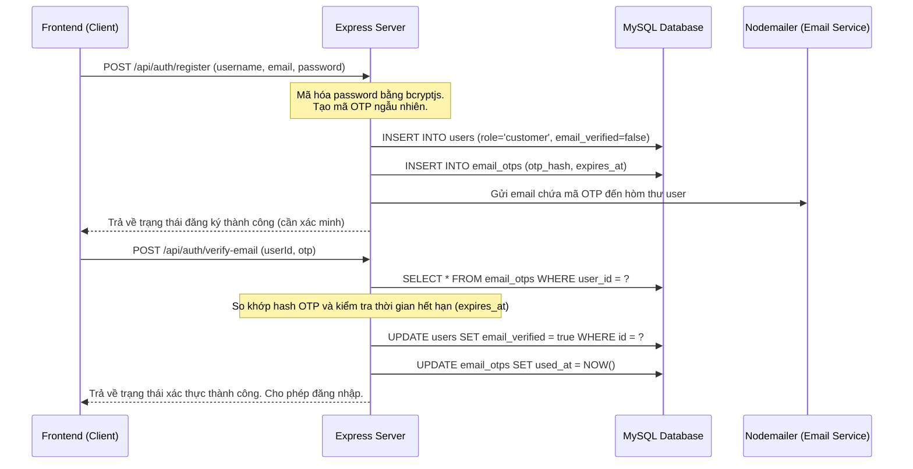
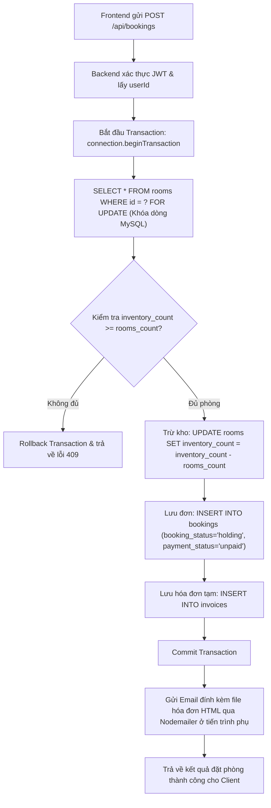
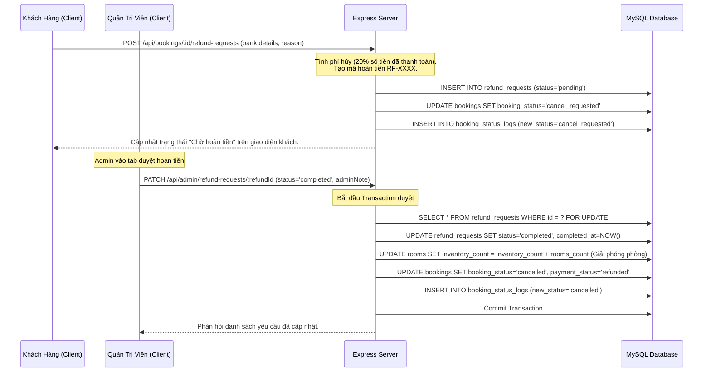

# Phân Tích Chi Tiết Hệ Thống Đặt Phòng Khách Sạn StayNest

Tài liệu này cung cấp cái nhìn chi tiết về kiến trúc hệ thống, công nghệ sử dụng ở từng tầng (Frontend, Backend, Database), luồng dữ liệu vận hành chính, cơ chế tích hợp API và bảng phân tích chi tiết từng file nguồn trong hệ thống.

---

## 1. Công Nghệ Sử Dụng (Technology Stack)

Hệ thống được thiết kế theo mô hình client-server truyền thống, tách biệt hoàn toàn Frontend (Single Page Application) và Backend (RESTful API), giao tiếp qua giao thức HTTP/JSON.

### 1.1. Frontend (Client-side)

- **Thư viện cốt lõi:** `React 19` (sử dụng functional components và React Hooks).
- **Trình đóng gói & Dev Server:** `Vite 8` (tối ưu hóa tốc độ build và Hot Module Replacement).
- **Quản lý trạng thái (State Management):** `Zustand 5` - Giải pháp quản lý state gọn nhẹ, hiệu năng cao thay thế cho Redux. Được dùng để quản lý session đăng nhập, thông tin người dùng và token JWT.
- **Quản lý dữ liệu Server (Server State & Caching):** `@tanstack/react-query 5` (React Query) - Giúp cache dữ liệu, tự động re-fetch và đồng bộ trạng thái giữa client và server (dành cho danh sách phòng, trạng thái đơn...).
- **Giao tiếp API:** `Axios 1` - Thực hiện các request HTTP, cấu hình interceptors để đính kèm Token và xử lý lỗi tập trung.
- **Điều hướng (Routing):** `React Router DOM 7` - Quản lý định tuyến trang, bảo vệ route (Route Guarding) chặn người dùng không có quyền truy cập trang admin/account.
- **Giao diện & Styling:** `TailwindCSS 3` kết hợp với custom CSS (`index.css`) tạo giao diện hiện đại, responsive và mượt mà với các hiệu ứng transition/hover.

### 1.2. Backend (Server-side)

- **Môi trường chạy:** `Node.js`.
- **Framework:** `Express.js 4` - Định nghĩa router, middleware và xử lý request/response RESTful.
- **Kết nối Cơ sở dữ liệu:** `mysql2 3` (sử dụng thư viện Promise wrapper) - Hỗ trợ Connection Pool để tối ưu hiệu năng kết nối MySQL và xử lý bất đồng bộ bằng `async/await`.
- **Bảo mật:**
  - `bcryptjs 3` - Mã hóa một chiều (hashing) mật khẩu người dùng trước khi lưu vào DB.
  - `jsonwebtoken 9` (JWT) - Tạo và xác thực access token cho cơ chế Stateful/Stateless API.
- **Tải tệp tin (File Upload):** `multer 2` - Xử lý upload ảnh phòng khách sạn định dạng multipart/form-data.
- **Gửi Email:** `nodemailer 8` - Gửi mã OTP xác thực đăng ký và gửi email đính kèm hóa đơn đặt phòng dạng HTML.

### 1.3. Cơ sở dữ liệu (Database - MySQL)

- **Hệ quản trị:** `MySQL`.
- **Đặc điểm thiết kế:**
  - Sử dụng quan hệ chặt chẽ (Foreign Keys) để đảm bảo toàn vẹn dữ liệu giữa các bảng `users`, `rooms`, `bookings`, `invoices`, `refund_requests`, `vouchers`...
  - Kiểu dữ liệu `JSON` được sử dụng trong bảng `rooms` (lưu trữ tiện ích `amenities_json` và danh sách ảnh phụ `gallery_json`).
  - Cơ chế khóa dòng (`SELECT ... FOR UPDATE`) để xử lý tranh chấp phòng (Race Condition) khi có nhiều người đặt cùng một lúc.

---

## 2. Cấu Trúc Thư Mục Chi Tiết

Mã nguồn được phân tách module hóa rõ ràng để dễ bảo trì và nâng cấp.

### 2.1. Backend (`/backend`)

```text
backend/
├── src/
│   ├── config/
│   │   └── coSoDuLieu.js         # Cấu hình MySQL Connection Pool
│   ├── middleware/
│   │   └── xacThuc.middleware.js # Middleware xác minh JWT và kiểm tra phân quyền (User/Admin)
│   ├── modules/                  # Chia thành các module nghiệp vụ riêng biệt
│   │   ├── admin/
│   │   │   └── quanTri.service.js# Logic quản lý khách hàng, dashboard admin
│   │   ├── auth/
│   │   │   └── xacThuc.service.js# Logic đăng ký, đăng nhập, mã hóa, gửi OTP
│   │   ├── bookings/
│   │   │   ├── datPhong.service.js      # Tạo đơn đặt phòng, khóa MySQL, hóa đơn
│   │   │   └── quanLyDatPhong.service.js# Quản lý trạng thái, hoàn tiền, doanh thu, thanh toán
│   │   ├── invoices/
│   │   │   └── hoaDon.service.js # Xử lý tạo và xuất file hóa đơn HTML
│   │   ├── notifications/
│   │   │   └── thuDienTu.service.js     # Cấu hình Nodemailer gửi email
│   │   ├── rooms/
│   │   │   └── phong.service.js  # Lấy danh sách phòng, phòng nổi bật
│   │   ├── system/
│   │   │   └── cauTrucVanHanh.service.js# Đảm bảo cấu trúc cột/bảng động mở rộng
│   │   └── vouchers/
│   │       └── voucher.service.js# Lưu và áp dụng mã giảm giá
│   ├── mayChu.js                 # File khởi chạy server (port mặc định 5000)
│   └── ungDung.js                # Khởi tạo Express, cài đặt middleware, gom các route API
├── uploads/                      # Thư mục chứa tệp tin tải lên (ảnh phòng, ảnh hóa đơn)
└── package.json                  # Khai báo dependency và script chạy server
```

### 2.2. Frontend (`/frontend`)

```text
frontend/
├── src/
│   ├── app/                      # Khởi chạy React App, Route chính và Layout chung
│   ├── components/               # Các component dùng chung (DauTrang, AdminLayout, RoomCard...)
│   ├── hooks/                    # Custom hooks (ví dụ: dùng chung gọi query)
│   ├── pages/                    # Các màn hình (pages) phân nhóm chức năng
│   │   ├── account/              # Hồ sơ cá nhân, lịch sử, khiếu nại hỗ trợ
│   │   ├── admin/                # Giao diện tổng quan, danh sách đơn, khách hàng, hoàn tiền
│   │   ├── auth/                 # Trang Đăng nhập, Đăng ký, Nhập mã OTP xác minh email
│   │   ├── bookings/             # Giao diện Đặt phòng (DatPhong.jsx), Đơn hàng của tôi
│   │   └── public/               # Trang chủ, giới thiệu, liên hệ
│   ├── services/                 # Định nghĩa các hàm gọi API thông qua Axios
│   │   ├── ketNoiApi.js          # Base Axios Client với Interceptors (đính token JWT)
│   │   ├── datPhongApi.js        # API liên quan đến bookings, hóa đơn, hoàn tiền, doanh thu
│   │   ├── phongApi.js           # API lấy thông tin phòng
│   │   ├── voucherApi.js         # API tương tác kho voucher
│   │   └── xacThucApi.js         # API Đăng ký/đăng nhập/gửi OTP
│   ├── store/                    # Quản lý state toàn cục bằng Zustand (khoXacThuc.js)
│   ├── utils/                    # Các hàm helper (dịnh dạng tiền, định dạng ngày...)
│   ├── index.css                 # File TailwindCSS và Custom Utility classes
│   └── main.jsx                  # Điểm khởi đầu của ứng dụng React
├── vite.config.js                # Cấu hình Vite, đặc biệt là Proxy `/api` tới backend port 5000
└── package.json                  # Khai báo các thư viện React, Tailwind, Zustand, Axios
```

---

## 3. Quy Trình Vận Hành & Luồng Dữ Liệu Từng Bước (Step-by-Step)

Dưới đây là mô tả chi tiết quy trình nghiệp vụ chính của hệ thống từ lúc Client gửi yêu cầu đến khi MySQL thực thi và phản hồi lại Client.

### 3.1. Luồng 1: Đăng ký Tài khoản & Xác minh Email qua OTP



### 3.2. Luồng 2: Đăng nhập & Đính kèm Token (Authentication)

- **Bước 1:** Khách hàng điền thông tin đăng nhập và gửi yêu cầu `POST /api/auth/login`.
- **Bước 2:** Backend truy vấn user bằng `username` trong database `users`.
- **Bước 3:** So sánh mật khẩu băm (bcrypt hash). Nếu trùng khớp, backend tiến hành ký mã JWT chứa `id`, `username`, và `role` của user.
- **Bước 4:** Trả thông tin JWT Token và User Profile về frontend dưới dạng JSON.
- **Bước 5:** Frontend nhận dữ liệu, gọi `Zustand store` (`useKhoXacThuc`) để lưu trữ token này vào bộ nhớ và đồng bộ với LocalStorage.
- **Bước 6:** Khi di chuyển trang:
  - Nếu `role = admin`, hệ thống tự động định tuyến đến trang `/admin/overview`.
  - Nếu `role = customer`, hệ thống định tuyến về trang chủ `/`.
- **Bước 7:** Với các request sau đó, Axios interceptor tự động lấy token từ Zustand và gán vào header: `Authorization: Bearer <token>`.

### 3.3. Luồng 3: Đặt phòng & Cơ chế Khóa dòng chống trùng phòng (Holding Booking)

Đây là phần quan trọng nhất nhằm tránh việc **Overbooking** (nhiều khách cùng thanh toán một căn phòng cuối cùng).



### 3.4. Luồng 4: Áp dụng Voucher & Xác nhận Thanh toán (Confirm Payment)

Khi đơn đặt phòng đang ở trạng thái giữ chỗ (`holding`), khách hàng có 15 phút (theo hạn `payment_deadline`) để thanh toán.

- **Bước 1:** Khách hàng vào trang **Đặt phòng của tôi**, chọn đơn và áp dụng mã giảm giá (voucher).
- **Bước 2:** Client gửi yêu cầu `POST /api/bookings/:id/payments/confirm` kèm theo thông tin: `method`, `voucherCode`.
- **Bước 3:** Backend khởi động Transaction:
  - **Kiểm tra Voucher:** Truy vấn bảng `vouchers`. Đảm bảo voucher còn hạn sử dụng, tổng số lượng chưa hết (`used_quantity < total_quantity`), và tổng tiền đơn hàng đáp ứng giá trị tối thiểu (`total_price >= min_order_amount`).
  - **Tính toán tiền giảm:** Nếu voucher hợp lệ, tính số tiền được giảm (`discount_amount`) theo phần trăm (có giới hạn trần `max_discount_amount`) hoặc số tiền cố định.
  - **Cập nhật số tiền mới:** Tính `total_price` mới sau giảm giá.
  - **Thay đổi trạng thái:**
    - Cập nhật `bookings`: Đổi `booking_status = 'confirmed'`, `payment_status = 'paid'` (hoặc `deposit_paid` nếu cọc), cập nhật tiền đã đóng `paid_amount` và cập nhật mã giao dịch `payment_code`.
    - Cập nhật `user_vouchers`: Đổi trạng thái mã giảm giá của user này sang `'used'`.
  - **Ghi log:**
    - Thêm bản ghi mới vào `payment_transactions` để lưu vết lịch sử dòng tiền.
    - Thêm bản ghi mới vào `booking_status_logs` phục vụ việc truy vết vòng đời đơn đặt phòng.
- **Bước 4:** Commit transaction và cập nhật giao diện của khách hàng thành công.

### 3.5. Luồng 5: Hủy đơn & Hoàn tiền (Cancellation & Refund)

Luồng hủy đơn được chia làm hai trường hợp tùy thuộc vào việc đơn đã được thanh toán hay chưa:

#### Trường hợp 1: Đơn hàng chưa thanh toán (`payment_status = 'unpaid'`)

Khách hàng có quyền hủy trực tiếp.

1.  Client gửi yêu cầu `PATCH /api/bookings/:id/status` với body `{ status: 'cancelled' }`.
2.  Backend bắt đầu Transaction.
3.  Cập nhật trạng thái đơn đặt phòng thành `'cancelled'` và điền thời gian hủy `cancelled_at`.
4.  **Giải phóng tồn kho:** Hoàn trả số phòng đã giấu về lại kho:
    `UPDATE rooms SET inventory_count = inventory_count + rooms_count WHERE id = room_id`.
5.  Ghi nhận log vào `booking_status_logs`.
6.  Commit transaction.

#### Trường hợp 2: Đơn hàng đã thanh toán (`payment_status` là `paid` hoặc `deposit_paid`)

Khách hàng không thể tự hủy mà phải gửi yêu cầu hoàn tiền chờ Admin phê duyệt.



---

## 4. Cơ Chế Kết Nối và Tích Hợp API (Get API Mechanism)

Frontend kết nối tới Backend thông qua cơ chế Proxy và Axios Interceptors như sau:

### 4.1. Cấu hình Vite Proxy (Tránh lỗi CORS ở môi trường phát triển)

Ở môi trường dev, Frontend chạy trên cổng `http://localhost:5714` trong khi Backend chạy trên cổng `http://localhost:5000`. Để tránh bị lỗi bảo mật CORS khi gọi API trực tiếp, file `vite.config.js` cấu hình một proxy chuyển tiếp:

```javascript
export default defineConfig({
  server: {
    host: "localhost",
    port: 5714,
    proxy: {
      "/api": {
        target: "http://localhost:5000",
        changeOrigin: true,
      },
    },
  },
});
```

_Ý nghĩa:_ Mọi đường dẫn bắt đầu bằng `/api` trên Frontend (ví dụ `/api/rooms`) sẽ tự động được Vite chuyển tiếp ngầm tới `http://localhost:5000/api/rooms`.

### 4.2. Base Axios Client & Request/Response Interceptors

File `frontend/src/services/ketNoiApi.js` đóng vai trò là cầu nối tập trung:

1.  **Gắn Token tự động (Request Interceptor):**
    ```javascript
    ketNoiApi.interceptors.request.use((config) => {
      const token = useKhoXacThuc.getState().token; // Lấy token từ Zustand Store
      if (token) {
        config.headers.Authorization = `Bearer ${token}`; // Gắn JWT Token vào header
      }
      return config;
    });
    ```
2.  **Xử lý lỗi Token hết hạn (Response Interceptor):**
    ```javascript
    ketNoiApi.interceptors.response.use(
      (response) => response,
      (error) => {
        // Nếu mã lỗi là 401 (Hết hạn token / Chưa đăng nhập)
        if (error.response?.status === 401 && useKhoXacThuc.getState().token) {
          useKhoXacThuc.getState().clearSession(); // Xóa token khỏi client, bắt đăng nhập lại
        }
        return Promise.reject(error);
      },
    );
    ```

### 4.3. Các hàm API đầu cuối (Endpoint Services)

Các file service con như `datPhongApi.js`, `phongApi.js` sử dụng instance `ketNoiApi` để gửi dữ liệu và bóc tách dữ liệu trả về:

```javascript
// Ví dụ lấy chi tiết phòng
export async function layChiTietPhong(roomId) {
  const response = await ketNoiApi.get(`/rooms/${roomId}`);
  return response.data.data; // Trả dữ liệu thực cho Component React
}
```

---

## 5. Phân Tích Chi Tiết Từng File Nguồn (File-by-File Analysis)

### 5.1. Backend Source Files (`/backend/src`)

| Đường dẫn File                                   | Công nghệ chính                                | Công dụng chính                                                                     | Cấu trúc & Logic cốt lõi                                                                                                                                                                                                                                                                                                                                                                                                                                                                                                                                                                                                                                                                                                                                                                                                                                                                                                                                                                                                                                                                                                                                                                                                                                                                                                                            |
| :----------------------------------------------- | :--------------------------------------------- | :---------------------------------------------------------------------------------- | :-------------------------------------------------------------------------------------------------------------------------------------------------------------------------------------------------------------------------------------------------------------------------------------------------------------------------------------------------------------------------------------------------------------------------------------------------------------------------------------------------------------------------------------------------------------------------------------------------------------------------------------------------------------------------------------------------------------------------------------------------------------------------------------------------------------------------------------------------------------------------------------------------------------------------------------------------------------------------------------------------------------------------------------------------------------------------------------------------------------------------------------------------------------------------------------------------------------------------------------------------------------------------------------------------------------------------------------------------- |
| **`mayChu.js`**                                  | Node.js, `dotenv`                              | Khởi chạy server chính & đồng bộ cơ sở dữ liệu động                                 | - Sử dụng `dotenv` để nạp các biến môi trường cấu hình cổng (`PORT`), thông tin kết nối DB và các khóa bảo mật JWT/Email.<br>- Tích hợp tiến trình đồng bộ hệ thống: trước khi gọi `ungDung.listen()`, server bắt buộc thực hiện `await damBaoCauTrucVanHanh()` để tự động bổ sung cột, bảng mới và chèn mã voucher mặc định vào DB mà không làm gián đoạn hệ thống.                                                                                                                                                                                                                                                                                                                                                                                                                                                                                                                                                                                                                                                                                                                                                                                                                                                                                                                                                                                |
| **`ungDung.js`**                                 | Express.js, `cors`, `multer`                   | Định cấu hình middleware toàn cục và điều phối định tuyến (Routing)                 | - Sử dụng `express.json()` để phân tích body dạng JSON, cài đặt `cors` cho phép domain của frontend (`http://localhost:5714`) giao tiếp.<br>- Cấu hình định mục lưu trữ tĩnh (`/uploads`) phục vụ tải hóa đơn và ảnh phòng.<br>- Tổ chức gom các nhóm Router: xác thực (`/api/auth`), phòng (`/api/rooms`), voucher (`/api/vouchers`), đặt phòng (`/api/bookings`), và các route quản trị có tiền tố `/api/admin` được bảo mật nghiêm ngặt qua 2 lớp middleware: `yeuCauDangNhap` và `yeuCauQuanTri`.                                                                                                                                                                                                                                                                                                                                                                                                                                                                                                                                                                                                                                                                                                                                                                                                                                               |
| **`config/coSoDuLieu.js`**                       | `mysql2/promise`                               | Quản lý kết nối cơ sở dữ liệu MySQL thông qua Connection Pool                       | - Sử dụng hàm `createPool()` của `mysql2` để tạo một nhóm kết nối dùng chung toàn cục.<br>- Định cấu hình giới hạn kết nối (`connectionLimit: 10`), thời gian chờ tối đa (`connectTimeout: 5000`), giúp tối ưu hóa tài nguyên server, tự động tái sử dụng các kết nối rảnh rỗi và giải phóng kết nối lỗi một cách tự động.<br>- Cung cấp interface dạng Promise giúp thực thi câu lệnh SQL bằng cơ chế bất đồng bộ (`async/await`) sạch sẽ.                                                                                                                                                                                                                                                                                                                                                                                                                                                                                                                                                                                                                                                                                                                                                                                                                                                                                                         |
| **`middleware/xacThuc.middleware.js`**           | `jsonwebtoken` (JWT)                           | Chốt chặn bảo mật (Guard) xác minh danh tính người dùng qua Token                   | - Định nghĩa hàm middleware `yeuCauDangNhap` nằm chặn trước các API yêu cầu định danh.<br>- Bóc tách chuỗi token từ header `Authorization: Bearer <token>`, sau đó giải mã bằng khóa bí mật `JWT_SECRET` thông qua hàm `jwt.verify()`.<br>- Lấy trường `sub` (chứa `id` của user), truy vấn cơ sở dữ liệu để lấy thông tin người dùng hiện tại thông qua hàm `timNguoiDungTheoId()`. Nếu người dùng không tồn tại hoặc bị khóa (`status = inactive`), lập tức từ chối và trả về mã lỗi `401 Unauthorized`. Nếu hợp lệ, gán đối tượng user vào `req.user` để truyền thông tin an toàn sang Controller kế tiếp.                                                                                                                                                                                                                                                                                                                                                                                                                                                                                                                                                                                                                                                                                                                                       |
| **`modules/auth/xacThuc.service.js`**            | `bcryptjs`, JWT, Nodemailer                    | Xử lý toàn bộ logic liên quan đến tài khoản, bảo mật mật khẩu và xác minh danh tính | - **Đăng ký tài khoản (`dangKyTaiKhoan`):** Nhận thông tin, sử dụng thư viện `bcryptjs` để băm mật khẩu thành chuỗi hash an toàn trước khi `INSERT` vào bảng `users`. Tạo mã OTP ngẫu nhiên gồm 6 chữ số, lưu trữ bản hash OTP và thời gian hết hạn (`expires_at`) vào bảng `email_otps`, đồng thời gọi dịch vụ email gửi OTP tới khách hàng.<br>- **Xác minh OTP (`xacMinhOtpEmail`):** So khớp mã OTP người dùng gửi lên với bản băm lưu trong DB. Nếu chính xác và chưa hết hạn, cập nhật trạng thái cột `email_verified = TRUE` trong bảng `users`.<br>- **Đăng nhập (`dangNhapTaiKhoan`):** Tìm kiếm tài khoản qua username, dùng `bcrypt.compare()` để so khớp mật khẩu truyền vào với chuỗi hash trong DB. Nếu khớp, tiến hành ký tạo mã Access Token JWT có thời hạn và trả về thông tin người dùng.                                                                                                                                                                                                                                                                                                                                                                                                                                                                                                                                        |
| **`modules/rooms/phong.service.js`**             | MySQL2 Query, JSON handling                    | Xử lý nghiệp vụ truy vấn danh sách, tìm kiếm và chi tiết phòng nghỉ                 | - **Lấy danh sách phòng (`layDanhSachPhong`):** Xây dựng câu truy vấn SQL động dựa trên các tham số tìm kiếm từ frontend như thành phố (`city`), khoảng giá (`price_min`/`price_max`), tiện ích (`amenities` lọc bằng câu lệnh kiểm tra mảng JSON của MySQL), số khách tối đa (`max_guests`).<br>- **Lấy chi tiết phòng (`layPhongTheoId`):** Thực hiện câu lệnh truy vấn kèm theo kết nối lấy danh sách ảnh phụ từ bảng phụ `room_images` để trả về trọn vẹn thông tin phòng.<br>- **Tạo phòng admin (`taoPhongAdmin`):** Cho phép admin chèn thêm phòng mới vào bảng `rooms` kèm mảng JSON danh sách tiện ích và ảnh.                                                                                                                                                                                                                                                                                                                                                                                                                                                                                                                                                                                                                                                                                                                             |
| **`modules/bookings/datPhong.service.js`**       | MySQL Database Transactions, Row Locking       | Quản lý quy trình đặt phòng nghỉ và tự động xuất hóa đơn                            | - Chứa hàm cực kỳ quan trọng: **`taoDatPhong`**.<br>- Thực hiện cô lập tiến trình bằng cơ chế Transaction (`connection.beginTransaction()`).<br>- Sử dụng câu lệnh khóa dòng **`SELECT ... FOR UPDATE`** đối với bảng `rooms` tại ID phòng được chọn, ngăn chặn tất cả các luồng tranh chấp phòng cùng thời điểm.<br>- Kiểm tra lượng tồn kho thực tế (`inventory_count`). Nếu không đủ phòng, thực hiện `rollback` giao dịch ngay lập tức để chống hiện tượng bán quá số phòng sẵn có (Overbooking).<br>- Nếu đủ phòng, thực thi cập nhật trừ kho phòng (`UPDATE rooms SET inventory_count = inventory_count - rooms_count`), ghi thông tin đơn đặt phòng vào bảng `bookings` với trạng thái mặc định `holding` và thời hạn thanh toán 15 phút (`payment_deadline`), chèn thông tin dịch vụ đi kèm vào bảng `booking_services`.<br>- Gọi module `hoaDon.service.js` để tự động tạo file hóa đơn dạng HTML tĩnh và ghi nhận vào bảng `invoices`. Cuối cùng, thực hiện `commit` giao dịch và gửi email đính kèm hóa đơn HTML đến hòm thư khách hàng.                                                                                                                                                                                                                                                                                                 |
| **`modules/bookings/quanLyDatPhong.service.js`** | MySQL Transaction, SQL Aggregation (Doanh thu) | Điều phối vòng đời đơn đặt phòng, thanh toán cọc/đủ, hoàn tiền, hỗ trợ và báo cáo   | - **Xác nhận thanh toán (`xacNhanThanhToan`):** Thực hiện transaction áp dụng mã giảm giá (voucher) bằng cách truy vấn bảng `vouchers`, kiểm tra điều kiện giá trị đơn tối thiểu (`min_order_amount`), tính toán số tiền giảm theo phần trăm hoặc số tiền cố định, ghi nhận số tiền đã thanh toán vào bảng `bookings`, cập nhật trạng thái đơn thành `confirmed`, chèn bản ghi lịch sử dòng tiền vào `payment_transactions`, cập nhật trạng thái voucher của user thành `used` trong `user_vouchers`. Tự động sinh mã quét QR check-in duy nhất (`checkin_qr_token`).<br>- **Hủy đơn & hoàn trả tồn kho:** Giải phóng phòng trả lại kho (`UPDATE rooms SET inventory_count = inventory_count + rooms_count`) khi đơn hàng chuyển sang trạng thái hủy (`cancelled`, `expired`, `no_show`).<br>- **Hoàn tiền (`taoYeuCauHoanTien`/`capNhatYeuCauHoanTien`):** Khi khách yêu cầu hủy đơn đã thanh toán, tính toán phí hủy phòng (20% số tiền đã nộp), tạo mã yêu cầu dạng `RF-XXXX` lưu vào bảng `refund_requests`, chuyển trạng thái đơn sang `cancel_requested` để chờ admin phê duyệt.<br>- **Thống kê doanh thu (`layBaoCaoDoanhThu`):** Thực thi các hàm tính toán gộp nhóm `SUM` và `COUNT` trên bảng `bookings` và `refund_requests` để xuất số liệu doanh thu thực tế, doanh thu dự kiến, số tiền hoàn trả cho quản trị viên theo khoảng ngày. |
| **`modules/invoices/hoaDon.service.js`**         | Node.js File System (`fs`), Path               | Tự động tạo, biên dịch mẫu HTML và quản lý file hóa đơn vật lý                      | - Chứa hàm `taoFileHoaDon` nhận vào thông tin Booking, Room, User và chuỗi dịch vụ phụ đi kèm.<br>- Đọc file mẫu hoặc tự động dựng template chuỗi HTML chứa đầy đủ thông tin chi tiết hóa đơn (mã hóa đơn, ngày nhận/trả phòng, giá tiền lẻ, tổng tiền sau giảm giá).<br>- Sử dụng module `fs.writeFileSync` ghi file trực tiếp xuống thư mục `uploads/invoices` với định dạng file `.html`. Việc lưu hóa đơn tĩnh giúp bảo đảm tính cố định của hóa đơn tài chính ngay cả khi dữ liệu phòng hoặc người dùng thay đổi trong tương lai.<br>- Cung cấp hàm `damBaoHoaDonTrongThuMucAdmin` hỗ trợ sao chép hoặc kiểm tra đường dẫn khi admin click tải xuống file hóa đơn từ trang quản trị.                                                                                                                                                                                                                                                                                                                                                                                                                                                                                                                                                                                                                                                           |
| **`modules/notifications/thuDienTu.service.js`** | `nodemailer`                                   | Cầu nối tích hợp cổng gửi thư điện tử SMTP                                          | - Sử dụng thư viện `nodemailer` để khởi tạo một SMTP Transporter (kết nối đến máy chủ Mail như Gmail hoặc các dịch vụ mail ảo).<br>- Định nghĩa hàm dùng chung **`guiMail({ to, subject, html, text, attachments })`** giúp toàn bộ hệ thống gửi email xác minh OTP hoặc đính kèm file hóa đơn HTML cho khách hàng một cách dễ dàng qua cơ chế bất đồng bộ, không gây nghẽn luồng xử lý chính.                                                                                                                                                                                                                                                                                                                                                                                                                                                                                                                                                                                                                                                                                                                                                                                                                                                                                                                                                      |
| **`modules/vouchers/voucher.service.js`**        | MySQL Query                                    | Xử lý logic hiển thị và lưu trữ mã giảm giá                                         | - **Lấy danh sách voucher (`layDanhSachVoucher`):** Truy vấn bảng `vouchers` lấy các mã giảm giá còn hiệu lực để hiển thị ở trang chủ.<br>- **Lưu voucher (`luuVoucherChoNguoiDung`):** Thêm bản ghi liên kết vào bảng `user_vouchers` cho phép người dùng lưu voucher về ví cá nhân để sử dụng sau.                                                                                                                                                                                                                                                                                                                                                                                                                                                                                                                                                                                                                                                                                                                                                                                                                                                                                                                                                                                                                                                |
| **`modules/admin/quanTri.service.js`**           | MySQL2 Query                                   | Vận hành dữ liệu danh mục khách hàng dành cho quản trị viên                         | - Cung cấp các hàm tìm kiếm, phân trang danh sách tài khoản khách hàng.<br>- **Xóa khách hàng (`xoaKhachHang`):** Chứa logic kiểm tra lịch sử đặt phòng. Nếu khách hàng chưa từng đặt phòng, thực hiện xóa vật lý khỏi bảng `users`. Nếu khách hàng đã phát sinh hóa đơn/booking, hệ thống tự động chuyển đổi phương thức sang xóa mềm bằng cách cập nhật trạng thái `status = inactive`, giữ nguyên lịch sử giao dịch nhằm đảm bảo báo cáo doanh thu chính xác.                                                                                                                                                                                                                                                                                                                                                                                                                                                                                                                                                                                                                                                                                                                                                                                                                                                                                    |
| **`modules/system/cauTrucVanHanh.service.js`**   | DDL (Data Definition Language)                 | Tự động cập nhật cấu trúc cơ sở dữ liệu động và dữ liệu Seed mặc định               | - Chốt chặn an toàn khi chạy ứng dụng trên máy mới hoặc khi nâng cấp tính năng.<br>- Thực thi các câu lệnh `ALTER TABLE` để bổ sung các cột mới nếu chưa có, hoặc cập nhật định nghĩa cột `ENUM` cho phù hợp với các trạng thái đặt phòng mới.<br>- Tạo mới các bảng bổ trợ như `vouchers`, `user_vouchers`, `payment_transactions`, `refund_requests`, `support_tickets` nếu MySQL chưa tồn tại.<br>- Tự động seed sẵn các mã voucher hệ thống (`DIEUBEL10`, `NOIDIA06`, `FAMILY08`, `WEEKEND150`...) để đảm bảo hệ thống luôn có sẵn mã ưu đãi hoạt động ngay lập tức.                                                                                                                                                                                                                                                                                                                                                                                                                                                                                                                                                                                                                                                                                                                                                                            |

---

### 5.2. Frontend Source Files (`/frontend`)

| Đường dẫn File                              | Công nghệ chính                       | Công dụng chính                                                                        | Cấu trúc & Logic cốt lõi                                                                                                                                                                                                                                                                                                                                                                                                                                                                                                                                                                                                                                                                                     |
| :------------------------------------------ | :------------------------------------ | :------------------------------------------------------------------------------------- | :----------------------------------------------------------------------------------------------------------------------------------------------------------------------------------------------------------------------------------------------------------------------------------------------------------------------------------------------------------------------------------------------------------------------------------------------------------------------------------------------------------------------------------------------------------------------------------------------------------------------------------------------------------------------------------------------------------- |
| **`vite.config.js`**                        | Vite Dev Server, Http-Proxy           | Cấu hình công cụ đóng gói và xử lý cổng kết nối proxy                                  | - Cấu hình cổng chạy ứng dụng ở cổng `5714`. Cài đặt thuộc tính `strictPort: false` để ứng dụng tự động nhảy sang cổng khác nếu cổng này bị chiếm dụng.<br>- Thiết lập cấu hình **`proxy`**: Định nghĩa bộ lọc chuyển tiếp toàn bộ request có tiền tố `/api` từ Client chạy ở `localhost:5714` đến Server chạy ở `http://localhost:5000` với cờ `changeOrigin: true` giúp loại bỏ hoàn toàn rào cản chính sách CORS trong môi trường lập trình local.                                                                                                                                                                                                                                                        |
| **`src/main.jsx`**                          | React 19 Client DOM                   | Khởi tạo môi trường React, nạp thư viện bổ trợ                                         | - Sử dụng hàm `createRoot()` từ thư viện `react-dom/client` để khởi tạo gốc ứng dụng.<br>- Nạp file CSS toàn cục (`index.css`), bọc toàn bộ ứng dụng bằng `<BrowserRouter>` (React Router DOM) phục vụ điều hướng trang và `<QueryClientProvider>` (React Query) phục vụ việc quản lý bộ nhớ đệm (caching) kết nối mạng.                                                                                                                                                                                                                                                                                                                                                                                     |
| **`src/index.css`**                         | TailwindCSS, CSS Variables            | Bản thiết kế phong cách mỹ thuật và kiểu dáng (Style Guide) hệ thống                   | - Nhập các thư viện cơ bản của TailwindCSS (`@tailwind base`, `components`, `utilities`).<br>- Khai báo các biến CSS toàn cục về màu sắc thương hiệu (Tone xanh navy sang trọng, màu vàng ánh kim đại diện cho StayNest cao cấp).<br>- Tự định nghĩa các lớp tiện ích riêng như tạo hiệu ứng chuyển động mượt mà (micro-animations), hiệu ứng gương mờ (glassmorphic cards) mang lại trải nghiệm thị giác cao cấp.                                                                                                                                                                                                                                                                                           |
| **`src/app/UngDung.jsx`**                   | React Router DOM 7                    | Xây dựng xương sống định tuyến và chốt chặn phân quyền bảo vệ trang (Route Guards)     | - Định nghĩa danh sách các tuyến đường (Routes) của hệ thống.<br>- Tích hợp logic phân quyền dựa trên trạng thái xác thực từ Zustand Store (`useKhoXacThuc`):<br> 1. Nếu người dùng chưa đăng nhập, tự động chuyển hướng về trang `/login` nếu họ cố truy cập vào các trang cá nhân `/account` hoặc `/bookings/my`.<br> 2. Nếu người dùng có vai trò là khách hàng (`role = customer`), hệ thống chặn tuyệt đối không cho phép truy cập bất kỳ đường dẫn nào có tiền tố quản trị `/admin/*`.<br> 3. Ngược lại, nếu người dùng là admin (`role = admin`), hệ thống tự động điều hướng trực tiếp họ vào trang dashboard `/admin/overview` và ẩn giao diện khách hàng thông thường để tránh lẫn lộn nghiệp vụ.  |
| **`src/store/khoXacThuc.js`**               | Zustand 5, Web Storage (LocalStorage) | Kho lưu trữ trạng thái phiên đăng nhập toàn cục                                        | - Sử dụng thư viện Zustand gọn nhẹ với middleware `persist` và `createJSONStorage`.<br>- Tự động đồng bộ trường `token` JWT và dữ liệu `user` profile xuống LocalStorage dưới tên khóa `staynest-auth`. Khi khách hàng mở lại trình duyệt hoặc tải lại trang (F5), Zustand tự động nạp lại dữ liệu từ LocalStorage giúp phiên đăng nhập được duy trì liên tục mà không cần gọi lại API xác thực từ server.                                                                                                                                                                                                                                                                                                   |
| **`src/services/ketNoiApi.js`**             | Axios Client, Interceptors            | Trạm trung chuyển API tập trung và xử lý lỗi mạng tự động                              | - Khởi tạo instance Axios có cấu hình đường dẫn gốc `baseURL: '/api'`.<br>- **`Request Interceptor`:** Tự động can thiệp vào tiến trình gửi request, lấy chuỗi token JWT từ Zustand Store để chèn vào Header dưới định dạng chuẩn `Authorization: Bearer <token>` trước khi request bay ra khỏi client.<br>- **`Response Interceptor`:** Lắng nghe toàn bộ phản hồi từ server. Nếu server trả về mã lỗi `401 Unauthorized` (Token hết hạn hoặc bị giả mạo), interceptor tự động kích hoạt hàm `clearSession()` để xóa sạch session lỗi trên client, chuyển hướng người dùng về trang đăng nhập để bảo vệ an toàn hệ thống.                                                                                   |
| **`src/services/xacThucApi.js`**            | Axios                                 | SDK gọi API đăng nhập, đăng ký và OTP                                                  | - Định nghĩa các hàm giao tiếp trực tiếp với endpoint xác thực của backend như: `dangKyTaiKhoan`, `xacMinhOtpEmail`, `dangNhapTaiKhoan`, `layUserHienTai`.                                                                                                                                                                                                                                                                                                                                                                                                                                                                                                                                                   |
| **`src/services/phongApi.js`**              | Axios                                 | SDK lấy danh sách và chi tiết phòng nghỉ                                               | - Định nghĩa hàm gọi API lấy danh sách phòng nghỉ kèm tham số tìm kiếm (`layDanhSachPhong`), lấy phòng nổi bật trang chủ (`layPhongNoiBat`), và lấy chi tiết từng căn phòng nghỉ (`layPhongTheoId`).                                                                                                                                                                                                                                                                                                                                                                                                                                                                                                         |
| **`src/services/datPhongApi.js`**           | Axios                                 | SDK thực hiện đặt phòng, thanh toán, hoàn tiền và xuất hóa đơn                         | - Chứa toàn bộ các hàm gọi API liên quan đến chu trình đặt phòng: gửi yêu cầu tạo booking mới (`taoDatPhong`), lấy lịch sử đặt phòng (`layDatPhongCuaToiApi`), cập nhật trạng thái đơn, thực hiện thanh toán (`xacNhanThanhToanDatPhongApi`), tạo đơn khiếu nại hỗ trợ, gửi yêu cầu hoàn tiền, và lấy báo cáo doanh thu admin.                                                                                                                                                                                                                                                                                                                                                                               |
| **`src/services/voucherApi.js`**            | Axios                                 | SDK tương tác kho mã giảm giá                                                          | - Chứa các hàm gọi API lấy danh sách voucher công khai hệ thống và kho voucher cá nhân của người dùng hiện tại, thực thi lưu voucher mới vào ví.                                                                                                                                                                                                                                                                                                                                                                                                                                                                                                                                                             |
| **`src/services/quanTriApi.js`**            | Axios                                 | SDK vận hành tác vụ quản trị                                                           | - Cung cấp hàm lấy dữ liệu tổng quan dashboard cho admin, danh sách khách hàng, tạo/sửa/xóa khách hàng.                                                                                                                                                                                                                                                                                                                                                                                                                                                                                                                                                                                                      |
| **`src/pages/auth/DangNhapDangKy.jsx`**     | React, Zustand, Axios, Hooks          | Màn hình đăng nhập, đăng ký tài khoản và nhập mã xác thực OTP                          | - Giao diện thiết kế nguyên khối (Tab-based) chuyển đổi linh hoạt giữa màn đăng nhập và đăng ký.<br>- Quản lý state bằng React Hooks (`useState`) để kiểm tra dữ liệu đầu vào (validation).<br>- Khi đăng ký thành công, tự động chuyển đổi giao diện sang màn hình nhập mã OTP gồm 6 chữ số, kết hợp nút đếm ngược thời gian gửi lại mã OTP (Resend OTP) mang lại sự chuyên nghiệp tối đa cho luồng đăng ký.                                                                                                                                                                                                                                                                                                |
| **`src/pages/public/TrangChu.jsx`**         | React, React Query                    | Màn hình trang chủ StayNest                                                            | - Thiết kế giao diện tràn viền sang trọng với thanh tìm kiếm nhanh (chọn thành phố, ngày đi, ngày về, số khách).<br>- Tích hợp React Query gọi API `layPhongNoiBat` để hiển thị danh sách các căn phòng nghỉ có đánh giá tốt nhất dưới dạng các thẻ card bóng bẩy, có hiệu ứng hover mượt mà.                                                                                                                                                                                                                                                                                                                                                                                                                |
| **`src/pages/rooms/DanhSachPhong.jsx`**     | React, React Query, URL SearchParams  | Trang danh mục phòng kèm bộ lọc động                                                   | - Phía bên trái thiết kế thanh bộ lọc thông minh (Lọc theo thành phố, giá tiền bằng thanh trượt, tiện ích phòng).<br>- Phía bên phải hiển thị danh sách phòng trống tương ứng dưới dạng danh sách lưới (Grid Layout).<br>- Sử dụng React Query đồng bộ hóa dữ liệu lọc tức thì khi người dùng thay đổi bộ lọc, kèm hiệu ứng hiển thị bộ khung tải chậm (Skeleton Loading) đẹp mắt.                                                                                                                                                                                                                                                                                                                           |
| **`src/pages/rooms/ChiTietPhong.jsx`**      | React, React Query, React Router      | Trang thông tin chi tiết của phòng nghỉ                                                | - Hiển thị bộ sưu tập ảnh (Gallery Carousel) của căn phòng nghỉ một cách sắc nét.<br>- Phân chia khu vực thông tin tiện nghi khoa học (wifi, điều hòa, bãi đỗ xe được hiển thị dưới dạng các biểu tượng icon chuyên nghiệp).<br>- Hiển thị bình luận đánh giá từ các khách hàng trước đó. Chứa nút kêu gọi hành động "Đặt phòng ngay" chuyển hướng kèm theo ID phòng đến trang đặt phòng.                                                                                                                                                                                                                                                                                                                    |
| **`src/pages/bookings/DatPhong.jsx`**       | React, React Query, Zustand           | Giao diện tính toán hóa đơn tạm tính và điền thông tin đặt phòng nghỉ                  | - **Xử lý state phức tạp:** Lưu trữ ngày check-in, ngày check-out, số khách, số phòng đặt.<br>- Danh sách dịch vụ phụ (Buffet sáng, xe đưa đón, trang trí phòng) hiển thị kèm giá tiền để khách hàng tích chọn.<br>- **Logic tính toán tại client:** Tự động tính toán tổng số đêm lưu trú, tính tiền phòng tạm tính, tiền dịch vụ và hiển thị tổng tiền dự kiến theo thời gian thực (Real-time calculation) giúp tăng trải nghiệm người dùng trước khi gửi yêu cầu POST tạo đơn hàng.                                                                                                                                                                                                                       |
| **`src/pages/bookings/DatPhongCuaToi.jsx`** | React, React Query, Axios             | Giao diện quản lý hóa đơn, quét mã thanh toán và yêu cầu hoàn tiền dành cho khách hàng | - Giao diện cực kỳ chi tiết hiển thị trạng thái của từng đơn đặt phòng (Đang giữ chỗ, Đã xác nhận, Đã trả phòng, Đã hủy).<br>- **Tích hợp thanh toán QR thông minh:** Với các đơn hàng ở trạng thái giữ chỗ (`holding`), giao diện hiển thị bảng quét mã QR thanh toán động. Hệ thống tích hợp ảnh QR chuyển khoản ngân hàng chứa sẵn thông tin số tiền và nội dung chuyển khoản chuẩn hóa giúp khách thanh toán tiện lợi.<br>- Cung cấp nút chọn mã voucher khả dụng để giảm trừ trực tiếp tiền phòng trước khi xác nhận thanh toán.<br>- **Yêu cầu hủy đơn/hoàn tiền:** Nếu đơn đã thanh toán, giao diện hiển thị form nhập thông tin tài khoản ngân hàng và lý do hủy để gửi yêu cầu hoàn tiền lên admin. |
| **`src/pages/account/TaiKhoan.jsx`**        | React, React Query                    | Trang cá nhân, quản lý ví voucher và gửi yêu cầu hỗ trợ khiếu nại                      | - Cho phép người dùng chỉnh sửa thông tin cá nhân và mật khẩu.<br>- Hiển thị "Ví voucher của tôi" chứa các mã ưu đãi đã lưu.<br>- Thiết lập phân mục hỗ trợ khiếu nại: Khách hàng gửi yêu cầu hỗ trợ trực tiếp chọn phân loại (Đặt phòng, thanh toán, hoàn tiền, tài khoản), viết tiêu đề, nội dung và gửi yêu cầu lên hệ thống. Danh sách yêu cầu đã gửi hiển thị rõ câu trả lời phản hồi từ admin khi được giải quyết.                                                                                                                                                                                                                                                                                     |
| **`src/pages/account/LichSu.jsx`**          | React, React Query                    | Trang lưu trữ lịch sử lưu trú của khách hàng                                           | - Liệt kê có tổ chức toàn bộ các đơn đặt phòng cũ đã hoàn tất (`completed`, `checked_out`) hoặc các đơn đã bị hủy trong quá khứ giúp khách hàng kiểm soát chi tiêu và lịch trình cá nhân.                                                                                                                                                                                                                                                                                                                                                                                                                                                                                                                    |
| **`src/pages/admin/AdminDashboard.jsx`**    | React, React Query                    | Bảng điều khiển trung tâm (Dashboard Overview) của quản trị viên                       | - Sử dụng các khối thẻ thống kê trực quan (Stats Cards) hiển thị 4 chỉ số cốt lõi: Doanh thu thực tế, Tổng đơn hàng, Số phòng trống khả dụng, và Số yêu cầu hoàn tiền/hỗ trợ đang chờ giải quyết.<br>- Thiết lập biểu đồ nhỏ biểu thị hoạt động của hệ thống, giúp admin nắm bắt nhanh tình hình kinh doanh của khách sạn chỉ trong một cái nhìn.                                                                                                                                                                                                                                                                                                                                                            |
| **`src/pages/admin/QuanLyDatPhong.jsx`**    | React, React Query                    | Màn hình phê duyệt và kiểm soát vòng đời đơn đặt phòng của Admin                       | - Danh sách toàn bộ đơn đặt phòng của hệ thống kèm theo thanh tìm kiếm nhanh theo mã đơn hàng hoặc tên khách hàng.<br>- Admin có các nút thao tác nhanh để thay đổi trạng thái đơn đặt phòng thực tế: Xác nhận đã cọc tiền (`confirmed`), Check-in khách vào phòng (`checked_in`), Check-out khách ra phòng và tự động thu đủ tiền còn thiếu (`checked_out`), hoặc Đánh dấu khách không đến nhận phòng (`no_show`).<br>- Cho phép admin điền ghi chú nội bộ (`admin_note`) để lưu lại các yêu cầu đặc biệt của khách hàng.                                                                                                                                                                                   |
| **`src/pages/admin/AdminCustomers.jsx`**    | React, React Query                    | Giao diện quản lý danh sách và tài khoản người dùng của Admin                          | - Hiển thị danh sách khách hàng dưới dạng bảng biểu chuẩn có phân trang.<br>- Cung cấp form tạo mới tài khoản khách hàng hoặc chỉnh sửa thông tin khách hàng hiện tại.<br>- Tích hợp nút khóa tài khoản khách hàng (`status = inactive`) hoặc xóa bỏ tài khoản khách hàng kèm theo cơ chế cảnh báo xóa mềm thông minh nếu khách hàng đó đã có đơn đặt phòng trong hệ thống.                                                                                                                                                                                                                                                                                                                                  |
| **`src/pages/admin/AdminInvoices.jsx`**     | React, React Query                    | Kho lưu trữ hóa đơn tài chính của hệ thống đặt phòng                                   | - Hiển thị danh sách toàn bộ các hóa đơn đã xuất cho khách hàng.<br>- Cho phép xem nhanh mã hóa đơn, mã đặt phòng liên quan, tên khách hàng và tổng tiền hóa đơn.<br>- Cung cấp nút hành động "Tải xuống hóa đơn HTML" giúp admin lưu trữ file hóa đơn vật lý về máy cá nhân khi cần kiểm toán.                                                                                                                                                                                                                                                                                                                                                                                                              |
| **`src/pages/admin/AdminOperations.jsx`**   | React, React Query                    | Trung tâm xử lý hoàn tiền khách hàng và chăm sóc hỗ trợ khiếu nại                      | - **Phê duyệt hoàn tiền:** Liệt kê các đơn yêu cầu hoàn tiền đang chờ xử lý (`pending`). Admin xem rõ số tiền khách đã đóng, phí hủy 20% bị khấu trừ, và số tiền thực tế cần chuyển khoản trả khách kèm thông tin tài khoản ngân hàng của họ. Admin ấn "Duyệt" (hệ thống tự động trả phòng về kho và đổi trạng thái đơn sang `cancelled`) hoặc "Từ chối" kèm theo lý do.<br>- **Phản hồi khiếu nại:** Hiển thị các câu hỏi hỗ trợ từ khách hàng. Admin điền nội dung câu trả lời và nhấn gửi để trả lời trực tiếp cho khách hàng.                                                                                                                                                                            |
| **`src/pages/admin/AdminRevenue.jsx`**      | React, React Query                    | Trang tổng hợp và xuất báo cáo doanh thu tài chính                                     | - Cho phép admin chọn khoảng thời gian bắt đầu và kết thúc bằng bộ chọn ngày.<br>- Hiển thị báo cáo chi tiết gồm Doanh thu gộp (Gross Revenue), Tiền chiết khấu voucher ưu đãi, Doanh thu ròng thực nhận (Paid Revenue), Phí thu hồi từ việc hủy đơn của khách (20% hủy phòng), và Số tiền còn phải thu dự kiến (Receivables).                                                                                                                                                                                                                                                                                                                                                                               |
| **`src/pages/admin/AdminRooms.jsx`**        | React, React Query, Axios             | Giao diện quản lý danh mục phòng nghỉ và tải lên ảnh đa phương tiện                    | - Hiển thị danh sách toàn bộ các loại phòng của khách sạn.<br>- Chứa form thêm phòng mới cực kỳ chi tiết (Tên khách sạn, tên phòng, thành phố, địa chỉ cụ thể, loại phòng Standard/Suite/Deluxe, giá tiền mỗi đêm, mô tả chi tiết, số khách tối đa).<br>- **Tích hợp tải ảnh thực tế:** Admin chọn ảnh đại diện (`cover_image`) và tối đa 7 ảnh chi tiết (`gallery_images`). Giao diện sử dụng đối tượng `FormData` gửi request chứa file lên API Multer backend để lưu trữ ảnh thực tế vào thư mục `/uploads/rooms` của server, tạo ra giao diện phòng chân thực, sinh động.                                                                                                                                |

---

### 5.3. Database Scripts (`/database`)

| Tên File                 | Công nghệ                                                               | Công dụng chính                                                                  | Cấu trúc & Nội dung cốt lõi                                                                                                                                                                                                                                                                                                                                                                                                                                                                                                                                                                                                                                                                                                                                                                                                                                                                                         |
| :----------------------- | :---------------------------------------------------------------------- | :------------------------------------------------------------------------------- | :------------------------------------------------------------------------------------------------------------------------------------------------------------------------------------------------------------------------------------------------------------------------------------------------------------------------------------------------------------------------------------------------------------------------------------------------------------------------------------------------------------------------------------------------------------------------------------------------------------------------------------------------------------------------------------------------------------------------------------------------------------------------------------------------------------------------------------------------------------------------------------------------------------------ |
| **`final_database.sql`** | MySQL DDL (Data Definition Language) & DML (Data Manipulation Language) | Kịch bản kiến thiết cấu trúc toàn bộ cơ sở dữ liệu và seed dữ liệu chuẩn ban đầu | - Định nghĩa 15 cấu trúc bảng quan hệ chặt chẽ đảm bảo tính toàn vẹn dữ liệu tối đa.<br>- Khai báo các khóa ngoại (`CONSTRAINT fk_* FOREIGN KEY`) liên kết bảng `bookings` với `users` và `rooms`; bảng `invoices` với `bookings`; bảng `refund_requests` với `bookings` và `users`... với thuộc tính xóa dây chuyền hoặc đặt null phù hợp (`ON DELETE CASCADE` / `ON DELETE SET NULL`).<br>- Khai báo cấu trúc bảng `rooms` sử dụng kiểu dữ liệu `JSON` hiện đại phục vụ việc lưu trữ mảng danh sách tiện ích (`amenities_json`) và các URL ảnh phụ (`gallery_json`).<br>- Seed dữ liệu mẫu đa dạng gồm: 16 phòng khách sạn cao cấp trải dài ở các tỉnh thành du lịch lớn (Hà Nội, TP.HCM, Đà Nẵng, Nha Trang, Sapa, Hội An, Phú Quốc) với đầy đủ thông tin vị trí, giá tiền, ảnh Unsplash sắc nét; seed sẵn 5 dịch vụ khách sạn và 6 voucher hệ thống giúp môi trường thử nghiệm hoạt động hoàn hảo ngay lập tức. |
